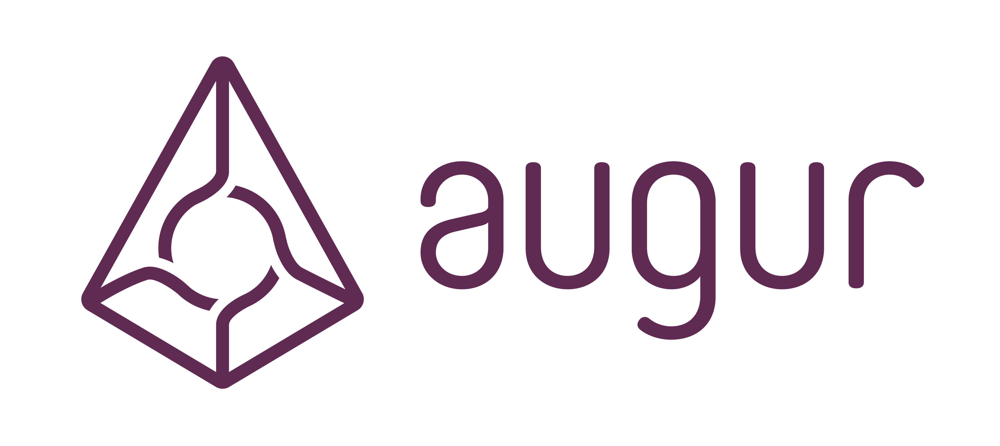
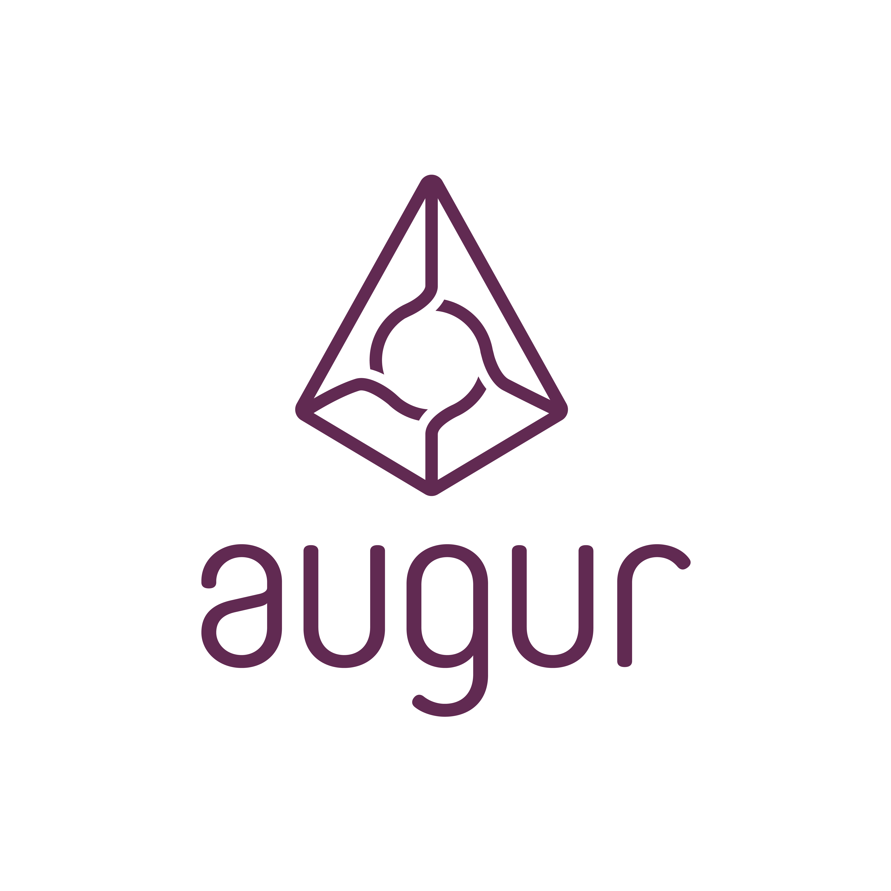
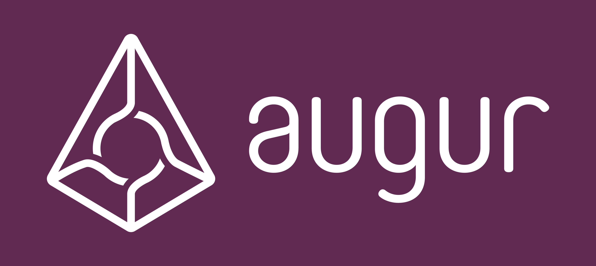

Augur Brand
============

Augur is a decentralized prediction market running on Ethereum.

##Logo
###Main logos
These are the two main logos for Augur including a vertical version for icons and avatars.

###Logos inverted

##Augur

##Augur Purple

The Augur color scheme uses Hex: #602A52

###Close Matches

####sRGB

| Red | Green | Blue |
|:---:|:-----:|:----:|
|  96  |   42  |  82  |

####CMYK

| Cyan | Magenta | Yellow | Key (Black) |
|:----:|:-------:|:------:|:-----------:|
| 60  |   91    |   40    |      31     |

##Fonts

###Core Mellow

Primary Font
-Used for Augur logo and headings

###Source Sans Pro
Secondary Font
- Used for body text and user interface
